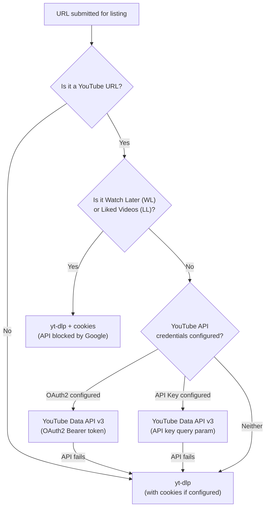

# YouTube Authentication & Scraping Behavior

This document describes how yt-diff decides which method to use when listing (indexing) and downloading YouTube content.

## Overview

yt-diff supports three authentication methods for YouTube, each suited to different use cases:

| Method | Env Vars | Use Case |
|---|---|---|
| **OAuth2** | `YOUTUBE_CLIENT_ID`, `YOUTUBE_CLIENT_SECRET`, `YOUTUBE_REFRESH_TOKEN` | All playlists and channels (public, unlisted, private) |
| **API Key** | `YOUTUBE_API_KEY` | Public and unlisted playlists/channels only |
| **Cookies** | `COOKIES_FILE` | Watch Later, Liked Videos, and any site requiring login (x.com, etc.) |

> **Note:** OAuth2 takes priority over API Key when both are configured.

## Listing (Indexing Playlist/Channel Items)

When a URL is submitted for listing, the following decision flow determines the method used:



### YouTube Data API Path (Fast)

Used for **all YouTube playlists and channels** when API credentials are configured.

- Fetches items via `playlistItems.list` endpoint (50 items/page)
- A 5,000-item playlist completes in ~50 seconds
- Channel URLs (`/@handle/videos`) are resolved to their uploads playlist via `channels.list`
- Items are converted to yt-dlp-compatible format for seamless DB integration
- Falls back to yt-dlp on any API failure

### yt-dlp Path (Slow, but universal)

Used as a fallback, or when no API credentials are configured.

- Fetches full metadata per video via `yt-dlp --dump-json`
- A 5,000-item playlist takes ~5 hours
- Protected by the smarter cleanup logic that prevents premature process termination
- Requires `COOKIES_FILE` for private content

### System Playlists (WL, LL)

Google intentionally blocked API access to Watch Later and Liked Videos in 2016. These always return 0 items via the API, even with valid OAuth2 credentials. They **must** use yt-dlp with cookies.

## Downloading (Fetching Video Files)

Downloads **always use yt-dlp**, regardless of API configuration. The YouTube Data API cannot download video files.

If `COOKIES_FILE` is set, yt-dlp receives `--cookies <file>` for YouTube URLs. This is needed for:

- Age-restricted videos
- Members-only content
- Any video requiring authentication

## Channel URL Support

Channel URLs are resolved to their uploads playlist via the YouTube Data API:

| URL Format | Example | Resolution |
|---|---|---|
| `/@handle` | `/@Hibiki_dad/videos` | `channels.list?forHandle=Hibiki_dad` → uploads playlist `UU...` |
| `/channel/UCxxxx` | `/channel/UC1234` | Direct conversion: `UC1234` → `UU1234` |
| `/c/name` | `/c/ChannelName/videos` | `channels.list?forHandle=ChannelName` → uploads playlist `UU...` |

The resolved uploads playlist is then fetched using the same `playlistItems.list` pagination as regular playlists.

## Cookie File

The `COOKIES_FILE` env var points to a Netscape-format cookie file. A single file can contain cookies for multiple domains:

```
# Netscape HTTP Cookie File
.youtube.com    TRUE    /    FALSE    0    SID       <value>
.x.com          TRUE    /    TRUE     0    auth_token <value>
```

yt-dlp only sends cookies to their matching domain — YouTube cookies are never sent to x.com and vice versa. This is enforced by the HTTP cookie specification.

## API Quota

The YouTube Data API v3 has a daily quota of **10,000 units** on the free tier.

| Operation | Cost | Example |
|---|---|---|
| `playlistItems.list` (1 page, up to 50 items) | 1 unit | 5,000-item playlist = 100 units |
| `channels.list` (resolve handle) | 1 unit | Once per channel URL |

This allows ~100 full scrapes of 5,000-item playlists per day.

## Playlist Duplicate Handling

YouTube allows the same video at multiple positions in a playlist. yt-diff matches this behavior:

- **Real playlists**: Duplicates are allowed. Each occurrence creates a separate mapping at its own position.
- **"None" playlist** (unlisted/unplaylisted videos): Duplicates are **not** allowed. Adding a video that already exists updates its position instead of creating a duplicate.

## Configuration Examples

### deno.json Tasks

```jsonc
{
  "tasks": {
    // Basic: yt-dlp only, no API, no cookies
    "dev": "SECRET_KEY_FILE=secret_key.txt DB_PASSWORD_FILE=db_password.txt deno run --allow-all --watch index.ts",

    // Cookies: yt-dlp with cookies (for WL, LL, x.com, age-restricted content)
    "cookies": "SECRET_KEY_FILE=secret_key.txt DB_PASSWORD_FILE=db_password.txt COOKIES_FILE=cookie_secret.txt deno run --allow-all --watch index.ts",

    // Full: OAuth API listing + cookies for WL/downloads
    "full": "SECRET_KEY_FILE=secret_key.txt DB_PASSWORD_FILE=db_password.txt COOKIES_FILE=cookie_secret.txt YOUTUBE_CLIENT_ID=<id> YOUTUBE_CLIENT_SECRET=<secret> YOUTUBE_REFRESH_TOKEN=<token> deno run --allow-all --watch index.ts"
  }
}
```

### Docker Compose

```yaml
environment:
  - YOUTUBE_API_KEY=<key>              # For public playlists (simple)
  # OR
  - YOUTUBE_CLIENT_ID=<id>             # For all playlists including private
  - YOUTUBE_CLIENT_SECRET=<secret>
  - YOUTUBE_REFRESH_TOKEN=<token>
  - COOKIES_FILE=/path/to/cookies.txt  # For WL, LL, and authenticated downloads
```
