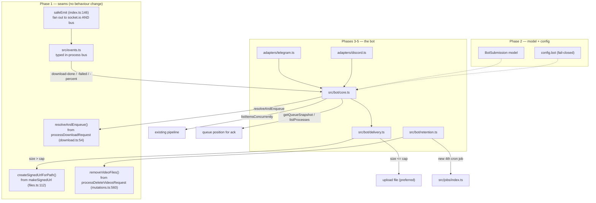

# yt-diff Chat Bot (Telegram + Discord)

## Context

yt-diff is web-only today: log into the React UI, paste a URL, watch it index over
WebSocket, click Download. Everything a bot needs already exists server-side —
yt-dlp orchestration, a download semaphore, URL canonicalization, signed file URLs
with Range support, cron jobs — but each capability is reachable *only* through an
HTTP handler that writes directly to a response object.

Goal: send a YouTube Shorts or x.com link to a bot, **get the video file back in the
chat**. A signed URL is the fallback for files too large to upload, not the norm.
Retention is configurable — ephemeral (file reaped after a day) or persistent.

Decisions taken: both platforms behind an adapter interface; in-process module inside
the existing Deno app, gated by env var; single-user via `BOT_ALLOWED_CHAT_IDS`;
global retention mode.

**The bot adds no new yt-dlp logic.** It is an intake and delivery layer over the
existing pipeline.

---

## Verified findings that change the original draft

I read the code rather than trusting the draft. Five things differ:

1. **The prune-job race the draft worried about does not exist.** Single-video
   listing always creates a `PlaylistVideoMapping` to the `None` pseudo-playlist
   (`listing.ts:325` for already-known videos, `listing.ts:1283` for new ones). The
   prune job (`jobs/index.ts:188`) only selects videos with *no* mapping at all, so
   it never sees a bot-downloaded video regardless of `downloadStatus`. Soft delete
   is safe — but not for the reason the draft gave.

2. **The bot does not need to classify playlist-vs-video before listing.**
   `executeListing` already does it (`listing.ts:507-509`), including the x.com
   single-item override:
   `itemType = playlistRegex.test(url) && !isSiteXDotCom(url) ? "playlist" : "unlisted"`.
   Pass `type: "undetermined"` and let the pipeline decide.

3. **Signed URLs are truncated, not just immortal.** `getSignedFileMetadata`
   (`routes/helpers/getSignedFileMetadata.ts:31`) calls `redis.expire(key,
   cacheMaxAge)` on every access — it slides to the *global* `CACHE_MAX_AGE` (1h)
   regardless of what TTL the URL was minted with, so a 6-hour bot link collapses to
   1 hour the first time anyone opens it. Per your call we keep sliding and drop the
   absolute-ceiling idea; the minimal fix is to slide by the entry's *own* TTL.

4. **The reaper's DB reset must null more columns than the draft said.** The web UI's
   delete-with-cleanup (`playlists/mutations.ts:668-679`) resets `downloadStatus,
   fileName, thumbNailFile, subTitleFile, commentsFile, descriptionFile,
   saveDirectory`. The reaper must match exactly, or reaped rows keep dangling
   sidecar filenames.

5. **GitNexus is absent from the checkout.** `.gitnexus/` does not exist and
   `.claude/` is gitignored, so CLAUDE.md's `impact()` / `detect_changes()` steps
   cannot run. Manual call-graph tracing is the substitute; say so in the PR rather
   than claiming they passed. Likewise `validation/` is an empty submodule — run
   `git submodule update --init` before the integration suite.

---

## Shape of the change



Submit flow, with the three dedupe tiers:

```
message ─► allowlist ─► normalizeUrl ─► look up VideoMetadata
                                            │
   ┌────────────────────────────────────────┼────────────────────────────────┐
   │ downloaded + file on disk              │ row exists (indexed)           │ no row
   ▼                                        ▼                                ▼
 deliver now                       skip listing entirely            listItemsConcurrently
 downloadedByBot = false           ─► resolveAndEnqueue             (ack: "indexing, N ahead")
 (reaper never touches it)                  │                                │
                                            │            listing failed ─► reply with reason
                                            ▼                                ▼
                                   ack: "queued #N"  ◄───── resolve DB row, resolveAndEnqueue
                                            ▼
                          bus: downloading-percent-update ─► throttled edit (1 per 5s)
                          bus: download-failed ───────────► reply "download failed: <reason>"
                          bus: download-done ─────────────► delivery
                                            ▼
                    size <= adapter.maxUploadBytes ─► UPLOAD (on failure ─► sign)
                    size >  adapter.maxUploadBytes ─► signed URL
```

---

## What gets reused as-is

| Capability | Where |
| :-- | :-- |
| URL canonicalization (Shorts → `watch?v=`, `youtu.be`, tracking strip) | `normalizeUrl` — `pipeline/process-manager.ts:149` |
| x.com single-item exception | `isSiteXDotCom` — `process-manager.ts:218` |
| Playlist detection | `playlistRegex` — `pipeline/types.ts:4` |
| Indexing (already non-HTTP-shaped) | `listItemsConcurrently` — `listing.ts:389` |
| Download queue + global semaphore | `download.ts` (`DownloadSemaphore`, `config.queue.maxDownloads`) |
| Live download queue positions | `getQueueSnapshot` — `download.ts:727` |
| Live listing queue depth | `listProcesses` map, already returned by `createPipelineHandlers` |
| Signed URL serving w/ Range + `Content-Disposition` | `index.ts:880` intercepts any `?fileId=`; `serveNativeFile.ts` handles it |
| Site auth args (cookies/proxy/iwara) | `buildSiteArgs` — `index.ts:373` |
| Playlist monitoring for `/watch` | `updatePlaylistMonitoring` — `playlists/mutations.ts:29` |
| Cron infrastructure | `src/jobs/index.ts` |

---

## Phase 1 — Seams

Five contained extractions. Each pulls a reusable core out of an HTTP-shaped handler
and leaves the HTTP wrapper calling that core. No behaviour change on the web path.

**1a. `src/events.ts` (new).** Tiny typed emitter — `on`, `off`, `emit` — with a
payload map covering the events already emitted: `download-started`,
`downloading-percent-update`, `download-done`, `download-failed`, `listing-error`.
Handler errors are caught and logged, never propagated.

**1b. `safeEmit` (`index.ts:146`).** After the existing socket.io emit, also
`botEvents.emit(event, payload)`. The pipeline is untouched — `safeEmit` is already
injected via `PipelineHandlerDependencies` (`types.ts:203`), so every emit site fans
out for free. The `download-done` payload already carries `{url, title, fileName,
saveDirectory, thumbNailFile, subTitleFile, descriptionFile}` (`download.ts:451`) —
everything delivery needs.

**1c. `resolveAndEnqueue` (`download.ts:54`).** `processDownloadRequest` resolves each
URL's `saveDirectory` from the DB, assigns `queuePosition`, starts
`downloadItemsConcurrently`, then writes an HTTP response. Extract the first three:

```ts
async function resolveAndEnqueue(
  urlList: string[],
  playlistUrl: string,
): Promise<{ items: (DownloadItem & { queuePosition: number })[]; notIndexed: string[] }>
```

The current 404 early-return for an unindexed URL (`download.ts:74-80`) becomes a
`notIndexed` entry; `processDownloadRequest` checks that array first and keeps its
exact 404 behaviour. Add to the return object at `download.ts:740` and surface
through `createPipelineHandlers` (`pipeline/index.ts:32`).

**1d. `createSignedUrlForPath` (`files.ts:112`).** Extract:

```ts
async function createSignedUrlForPath(
  absPath: string,
  ttlSeconds = config.cache.maxAge,
): Promise<{ signedUrlId: string; expiry: number }>
```

Resolves the MIME via the existing `mimeTypes` map, writes the Redis entry including
the `ttl` it was minted with. Call it from `makeSignedUrl`, `makeSignedUrls`, and the
bot. **This fixes the bulk MIME bug** (side-fix #1): `makeSignedUrls`
(`files.ts:274`) hardcodes `"application/octet-stream"`, so bulk-signed files
download instead of playing inline even with `?inline=true`, because
`serveNativeFile` sets `Content-Type` from the stored value.

**1e. Slide by the entry's own TTL (`getSignedFileMetadata.ts:31`).** Keep the
sliding-window behaviour exactly as it is — no absolute ceiling. The single change:
read `ttl` out of the stored entry and `redis.expire(key, entry.ttl ?? cacheMaxAge)`
instead of always `cacheMaxAge`. Entries written before this change have no `ttl` and
fall back to today's behaviour. Without this, every bot link silently drops to 1 hour
on first open.

**1f. `removeVideoFiles` (new, `src/handlers/videoFiles.ts`).** Lift the file-removal
loop from `processDeleteVideosRequest` (`mutations.ts:560-613`) into
`removeVideoFiles(video: VideoMetadata): Promise<boolean>` — builds the
`{fileName, thumbNailFile, subTitleFile, commentsFile, descriptionFile}` map, joins
against `config.saveLocation + saveDirectory`, unlinks what exists, returns whether
all removals succeeded. Both the web delete path and the reaper call it, so the two
cannot drift.

Verification: `deno task ship` clean, `deno task test:unit` green, and the web UI's
download / get-file / delete-with-cleanup flows behave identically.

---

## Phase 2 — Model and config

**`BotSubmission` in `src/db/models.ts`**, following the existing `Model` +
`InferAttributes` style:

```ts
id: UUID (pk, UUIDV4)
platform: STRING           // "telegram" | "discord"
chatId: STRING
messageId: STRING | null
requestedUrl: STRING       // as typed
canonicalUrl: STRING|null  // after normalizeUrl(); FK → video_metadata.videoUrl,
                           //   allowNull: true, onDelete: SET NULL
kind: STRING               // "video" | "playlist"
playlistUrl: STRING | null
status: STRING             // pending|indexing|downloading|delivered|failed|reaped
deliveryMode: STRING|null  // "upload" | "signed_url"
retention: STRING          // "ephemeral" | "persistent"
downloadedByBot: BOOLEAN   // false when the file already existed — reaper skips it
expiresAt: DATE | null     // null when persistent or downloadedByBot=false
errorMessage: TEXT | null
```

`downloadedByBot` is the guard that makes your rule "don't delete files the bot
didn't download" enforceable in SQL rather than by convention.

Indexes on `["status", "expiresAt"]` (reaper) and `["canonicalUrl"]` (dedupe). The FK
must be `SET NULL`, not `CASCADE` — a video deleted from the web UI must not erase
submission history. Add the model to the log line at `models.ts:381`.
`sequelize.sync({ alter: true })` (`models.ts:365`) creates the table; adding a table
is safe under `alter`, so no migration tooling is needed here.

**`config.bot` in `src/config.ts`**, using the existing `readTrimmedFile` /
`fileExists` secret convention:

| Var | Default | Purpose |
| :-- | :-- | :-- |
| `BOT_ENABLED` | `false` | Master switch; nothing is constructed when false |
| `BOT_TELEGRAM_TOKEN_FILE` / `BOT_DISCORD_TOKEN_FILE` | — | Presence of each enables that adapter |
| `BOT_ALLOWED_CHAT_IDS` | — | Comma-separated. Empty ⇒ refuse to start |
| `BOT_PUBLIC_BASE_URL` | — | External origin for signed URLs; `config.host` is often container-internal |
| `BOT_RETENTION_MODE` | `ephemeral` | `ephemeral` \| `persistent` |
| `BOT_RETENTION_HOURS` | `24` | |
| `BOT_REAP_INTERVAL` | `0 * * * *` | Reaper cron |
| `BOT_SIGNED_URL_TTL` | `21600` | 6h — works correctly once 1e lands |
| `BOT_TELEGRAM_MAX_UPLOAD` | `50000000` | Raise to ~2 GB with a local Bot API server |
| `BOT_DISCORD_MAX_UPLOAD` | `10485760` | 10 MiB non-boosted; 50/100 MiB at boost L2/L3 |
| `BOT_MAX_PENDING_PER_CHAT` | `5` | Backpressure |

No `BOT_RETENTION_HARD_DELETE` — per your answer, reaping only ever deletes the file
and marks the video undownloaded. The DB row always survives.

**Fail closed:** `BOT_ENABLED=true` with an empty `BOT_ALLOWED_CHAT_IDS` logs an
error and starts no adapters. An open bot on a yt-dlp box lets anyone who can message
it make the server fetch arbitrary URLs through the VPN and fill the disk.

Add `grammy` and `discord.js` to `deno.json` imports as `npm:` specifiers and
regenerate `deno.lock` — the Dockerfile runs `deno cache --lock=deno.lock index.ts`
(line 141) and fails on a stale lock. Add the new env rows to `envs/base.env`.

---

## Phase 3 — Core + Telegram adapter

```
src/bot/index.ts          createBotService({...}) → { start, stop }; adapter registry
src/bot/types.ts          BotAdapter, IncomingMessage, DeliveryTarget, MessageRef
src/bot/core.ts           command parsing, submit flow, dedupe, progress throttling
src/bot/delivery.ts       upload-first decision, signed-URL fallback
src/bot/retention.ts      reaper logic (called by the cron job)
src/bot/adapters/telegram.ts
src/bot/adapters/discord.ts
```

```ts
// src/bot/types.ts
export interface BotAdapter {
  readonly platform: "telegram" | "discord";
  readonly maxUploadBytes: number;
  start(onMessage: (m: IncomingMessage) => Promise<void>): Promise<void>;
  stop(): Promise<void>;
  sendText(to: DeliveryTarget, text: string): Promise<MessageRef>;
  editText(ref: MessageRef, text: string): Promise<void>;
  sendFile(to: DeliveryTarget, absPath: string, caption: string): Promise<MessageRef>;
}
```

`BotCore` is platform-agnostic and holds all command, dispatch, and dedupe logic;
each adapter is ~80 lines. `createBotService` takes `{ listItemsConcurrently,
resolveAndEnqueue, createSignedUrlForPath, getQueueSnapshot, listProcesses,
updatePlaylistMonitoring, events }` — all injected, matching the codebase's dominant
`createX({deps})` factory pattern.

**Wiring in `index.ts`.** `initializeDatabase()` is fire-and-forget (`index.ts:241`)
and the bot needs both the `BotSubmission` table and the admin user row. Change it to
`const dbReady = initializeDatabase();` and `await dbReady` inside `bootstrapRuntime()`
(`index.ts:830`) before `botService.start()`, after `startJobs(jobs)`. Extend the
existing SIGINT/SIGTERM listeners (`index.ts:494-503`) to call `botService.stop()`
alongside `terminateChildProcesses()`.

### Dedupe — three tiers, checked in order

Nothing gets re-indexed or re-downloaded if the DB already knows about it.

1. **Downloaded and the file is still on disk** → deliver immediately. No listing, no
   download, no yt-dlp process. Record the submission with
   `downloadedByBot=false, expiresAt=null` so **the reaper never deletes a file the
   bot didn't fetch** — including anything the web UI downloaded and anything a
   previous ephemeral submission has already delivered and kept.
2. **Row exists in `VideoMetadata` but not downloaded** → already indexed, so skip
   `listItemsConcurrently` entirely and go straight to `resolveAndEnqueue`.
3. **No row** → index, then enqueue.

For tier 3, **re-resolve the DB row before enqueueing**: the URL stored by listing
comes from yt-dlp's `webpage_url` and can differ from `normalizeUrl(input)`. Look up
by `videoUrl`; on a miss, fall back to the `videoId` + host match the listing code
already uses (`listing.ts:250-270`). Use the row's actual `videoUrl`, or fail the
submission with a clear message.

### Acknowledgement and progress — the queue is visible

The pipeline is semaphore-bound (`MAX_LISTINGS`/`MAX_DOWNLOADS`, both default 1), so
a request can sit waiting. Every submission gets an immediate reply that says where
it is, then the *same message* is edited as it advances:

| Stage | Message |
| :-- | :-- |
| Accepted, needs indexing | `Indexing… (N ahead in the listing queue)` — from `listProcesses.size` |
| Accepted, already indexed | `Queued for download — position N` |
| Enqueued | position from `getQueueSnapshot()` matched on the URL, falling back to the `queuePosition` returned by `resolveAndEnqueue` |
| Running | `Downloading… 42%` — throttled |
| Done | replaced by the uploaded file or the link |

`getQueueSnapshot()` re-indexes positions 1..n over live processes, so it gives a
truthful "you are Nth", unlike the raw monotonic `queueSequence`.

**Throttle progress edits to one per 5s per chat**, coalescing rather than queueing.
Telegram rate-limits edits aggressively (~20/min to a group); an unthrottled progress
bar gets the bot temporarily banned.

### Failure reporting

Every terminal failure replies in-chat with the stage and the reason, and writes
`status='failed'` plus `errorMessage` on the submission:

- **Listing failed** — `listItemsConcurrently` resolves with `ListingResult[]`; a
  non-`completed` status or an empty result becomes
  `Couldn't index that link: <status/error>`. No bus subscription needed, it's a
  plain awaited return value.
- **Not indexable** — `resolveAndEnqueue` returned the URL in `notIndexed`:
  `That link indexed but produced no video entry.`
- **Download failed** — bus `download-failed` for that URL:
  `Download failed: <reason>` (`download.ts:485` distinguishes SIGTERM-killed from a
  non-zero exit code).
- **Nothing happened** — a watchdog timeout on the bus subscription, so a submission
  can never hang silently if the process dies before emitting.
- **Upload failed** — not user-visible as a failure; it degrades to a signed URL.

### Delivery — upload first, always

```
absPath = join(config.saveLocation, saveDirectory, fileName)   // from download-done
size    = (await stat(absPath)).size

size <= adapter.maxUploadBytes  → adapter.sendFile(...)          ← the goal
                                  on error → createSignedUrlForPath, reply link
size >  adapter.maxUploadBytes  → createSignedUrlForPath(absPath, config.bot.signedUrlTtl)
                                  reply `${BOT_PUBLIC_BASE_URL}${config.urlBase}/file?fileId=<uuid>`
```

A signed URL is only ever sent when the file genuinely exceeds the platform ceiling,
the upload call failed, or the user explicitly asked with `/link`. No new HTTP route
is needed: `index.ts:880` intercepts any request carrying `?fileId=` before route
dispatch, and `serveNativeFile.ts` already handles Range and `Content-Disposition`.

### Command surface

| Input | Behaviour |
| :-- | :-- |
| bare URL, or `/get <url>` | Index → download → deliver. The main path. |
| `/link <url>` | Fetch but always reply with a signed URL, never upload |
| `/keep <id>` | Promote an ephemeral submission to persistent before the reaper runs |
| `/watch <playlist-url> [Start\|End\|Full]` | Register a monitored playlist; `listItemsConcurrently` then `updatePlaylistMonitoring` |
| `/status` | `getQueueSnapshot()` |
| `/history [n]` | Recent `BotSubmission` rows |
| `/rm <id>` | `removeVideoFiles` + mark reaped |
| `/help` | |

Messages from a chat not in the allowlist are **silently ignored** — no
"unauthorized" reply, which would confirm the bot exists to anyone probing.

`--audio` and quality flags are deferred: `downloadOptions` is frozen at import time
(`pipeline/types.ts:6`), built once from global config, so per-request format
selection needs the arg-builder refactor already logged as Future Milestone #1 in
`docs/ISSUES_AND_IMPROVEMENTS.md`. Note the gap in `docs/BOT.md`.

---

## Phase 4 — Discord adapter

Same `BotAdapter` interface, `discord.js` client, `maxUploadBytes` from
`BOT_DISCORD_MAX_UPLOAD`. This phase exists to prove the abstraction holds — if it
needs `BotCore` changes, the seam is in the wrong place. At 10 MiB the signed-URL
fallback is the common case there, which is exactly what the size check is for.

---

## Phase 5 — Retention

`jobs.botRetention` in `src/jobs/index.ts`, registered only when the bot is enabled.
Widen the type to
`Record<"cleanup" | "update" | "prune", CronJob> & { botRetention?: CronJob }` —
`startJobs` iterates `Object.entries`, so it needs no change. Construct it like the
existing three: `new CronJob(schedule, fn, null, true, config.timeZone)`.

Every `BOT_REAP_INTERVAL`, for submissions where
`retention='ephemeral' AND downloadedByBot=true AND expiresAt < now() AND status='delivered'`:

1. `removeVideoFiles(video)` — media plus all four sidecars.
2. Reset the video row to match `mutations.ts:668-679` exactly: `downloadStatus=false,
   fileName=null, thumbNailFile=null, subTitleFile=null, commentsFile=null,
   descriptionFile=null, saveDirectory=null`. The `VideoMetadata` row itself and its
   `None` mapping stay, so `/history`, search, and one-command re-fetch keep working.
3. Mark the submission `reaped`.

Three guards, all load-bearing:

- **`downloadedByBot=true` only.** A file that already existed when the bot was asked
  for it is never reaped — that covers web-UI downloads and re-sends of something the
  bot fetched earlier and already reaped-and-refetched.
- **Only reap videos that have a `BotSubmission`.** Belt and braces on the same rule.
- **Skip anything mapped to a playlist with `monitoringType` in `Start/End/Full`.** A
  `/watch`ed channel's videos are persistent by definition, or the reaper and the
  scheduled-update job (`jobs/index.ts:96`) fight over the same files.

---

## Phase 6 — The two side fixes and one doc note

**Fix — bulk-signing MIME (side-fix #1).** Falls out of seam 1d; no separate work.

**Fix — CORS multi-origin header (side-fix #3).** `generateCorsHeaders`
(`utils/http.ts:129`) does `allowedOrigins.join(", ")`.
`Access-Control-Allow-Origin` accepts exactly one origin or `*`; a comma-joined list
is rejected by every browser. It works today only because `CORS_ALLOWED_ORIGINS`
(`utils/http.ts:26`) has a single entry — adding a second silently breaks all CORS.
There are 78 call sites, so don't thread the request through all of them. Add an
optional `requestOrigin` to the existing options object: emit `requestOrigin` when it
is in the allowlist, otherwise `allowedOrigins[0]`, and always set `Vary: Origin`.
Every current call site keeps working unchanged and the header becomes valid for
multi-origin configs.

**Document — rate limiting off by default (side-fix #4).**
`RATE_LIMIT_GLOBAL_MAX_REQUESTS` defaults to `""` → `parseInt` → `0`, and `rateLimit`
treats `0` as disabled (`middleware/rateLimit.ts:57`). Note in
`docs/ISSUES_AND_IMPROVEMENTS.md` that a security control defaulting to off when
unset is backwards, and that a non-zero default with an explicit `0` opt-out is the
safer shape. No code change.

Also worth a line in the same doc: the root `package.json` is literally `{}` while
`deno.json` holds the real dependency graph, which makes Dependabot
(`.github/dependabot.yml`) mis-detect the project as npm-with-no-dependencies.

---

## Phase 7 — Docs

`docs/BOT.md` (setup, commands, dedupe tiers, retention semantics, the deferred
`--audio` note), env-var rows in `docs/GETTING_STARTED.md`, a reaper entry in
`docs/AUTOMATED_JOBS.md`, `BotSubmission` in `docs/DATABASE_SCHEMA.md`, and the
reaper's "never touches files it didn't download" rule in
`docs/DELETION_BEHAVIOR.md`.

---

## Verification

**Unit** (`deno task test:unit`, `Deno.test` style matching `tests/*.test.ts`):

- Delivery decision at the size boundary — `size === maxUploadBytes` uploads, `+1`
  signs; a thrown `sendFile` falls back to a signed URL rather than erroring.
- Dedupe tiers — downloaded+on-disk calls neither `listItemsConcurrently` nor
  `resolveAndEnqueue`; indexed-not-downloaded calls only `resolveAndEnqueue`.
- Reaper selection — skips `downloadedByBot=false`; skips a video with no
  `BotSubmission`; skips one mapped to a `Start/End/Full` playlist; selects an expired
  ephemeral bot download.
- Allowlist rejection is silent: returns without calling any adapter send method.
- `resolveAndEnqueue` returns an unindexed URL in `notIndexed` rather than throwing.
- Sliding TTL uses the entry's own `ttl`, falling back to `cacheMaxAge` when absent.
- `generateCorsHeaders` emits exactly one origin with a two-entry allowlist.

(`normalizeUrl` on Shorts / `youtu.be?si=` / channel handles is already covered by
`tests/process_manager.test.ts:10` — no new cases needed.)

**Integration** (`git submodule update --init validation`, then
`cd validation && deno task test`): the existing `/download` and `/getfile` API tests
must pass unchanged. That is the regression guard for seams 1c, 1d, and 1e, and for
the CORS change.

**Manual, end to end.** `deno task dev` with `BOT_ENABLED=true`, a Telegram token,
your own chat ID:

1. Send a YouTube Short → **the video file itself lands in the chat**, not a link.
2. Watch the ack: it should name a queue position and then edit in place to a
   percentage, not spam new messages.
3. Send a >50 MB video → a signed URL. Open it, confirm it streams (Range) and the
   filename is right. **Open it again 90 minutes later and confirm it still works** —
   that is the 1e fix.
4. Send the same URL again → immediate delivery, no yt-dlp process spawned at all
   (check the logs for absence of a listing and a download).
5. Send a URL that is indexed but not downloaded (queue one from the web UI without
   downloading) → download starts, no re-indexing.
6. Send a garbage URL → `Couldn't index that link: …`. Kill a download mid-flight →
   `Download failed: Process was killed…`.
7. Send an x.com link → treated as a single item, not a playlist.
8. Send from a non-allowlisted account → no reply at all.
9. Set `BOT_RETENTION_HOURS=0`, wait for the reaper → the bot's file is gone from
   `SAVE_PATH`, the `VideoMetadata` row is intact with `downloadStatus=false` and all
   file columns null, submission marked `reaped`.
10. Confirm in the same pass that a web-UI-downloaded video **and** a video the bot
    merely re-delivered from an existing download were both left alone.
11. Web UI regression: index, download, and delete-with-cleanup all still work.

**Pre-commit:** `deno task ship` (check + lint + fmt). CLAUDE.md's `detect_changes()`
/ `impact()` steps cannot run — GitNexus is absent from this checkout — so say so in
the PR body rather than claiming they passed.
